# Tarea 3. AWS

## Instancia de Windows Server 2019

- [x]  Detalle de la instancia

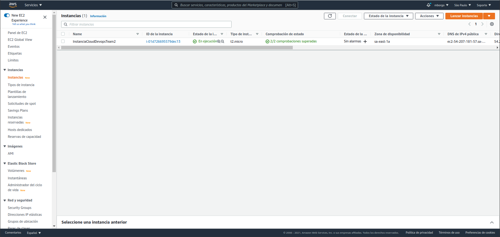

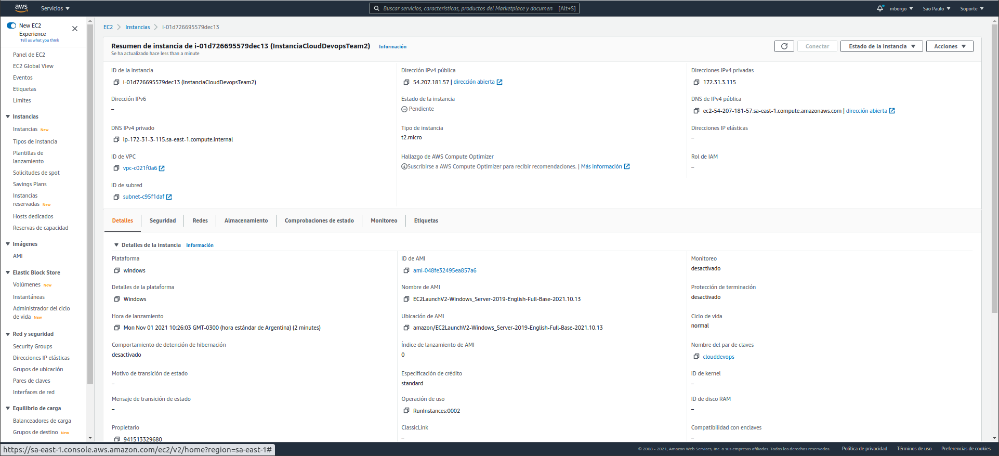

- [x]  Grupo de seguridad con zona de disponiblidad A de Sudamerica 

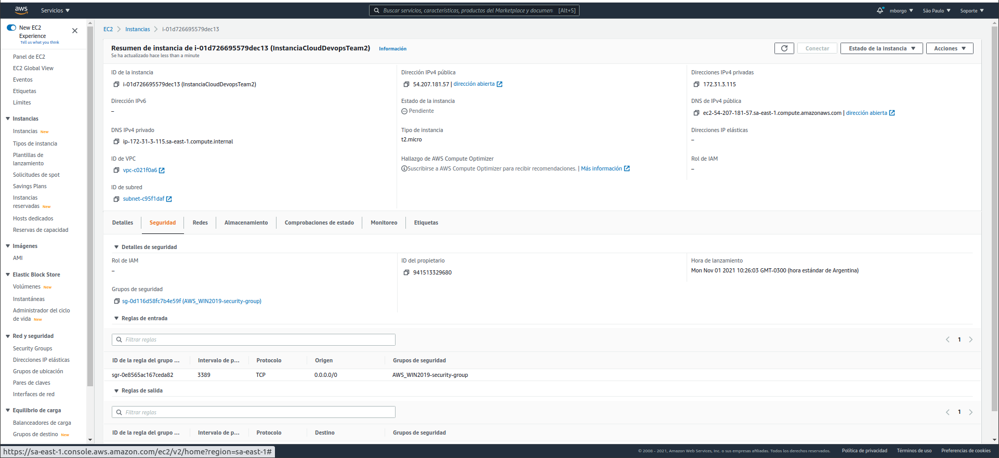

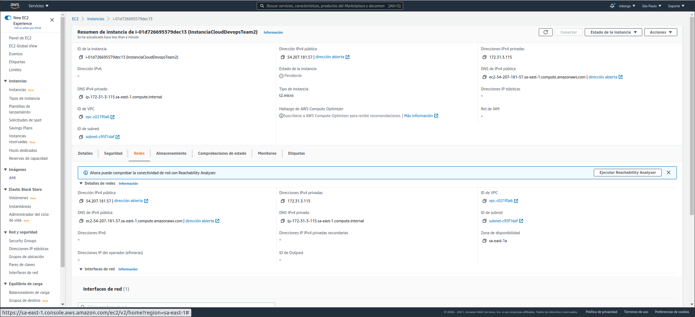

- [x]  Tags: Año. S.O., Equipo, Carrero, Institucion, Proyecto y Entorno

- [x]  Disco Rigido EBS de 30GB ABS

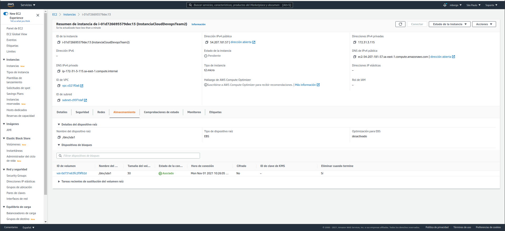

- [x]  Acceso por RDP a la instancia

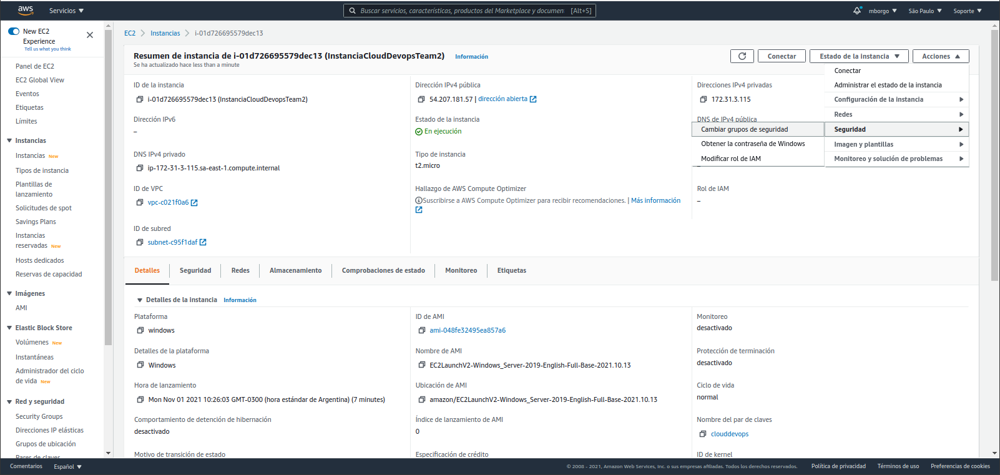

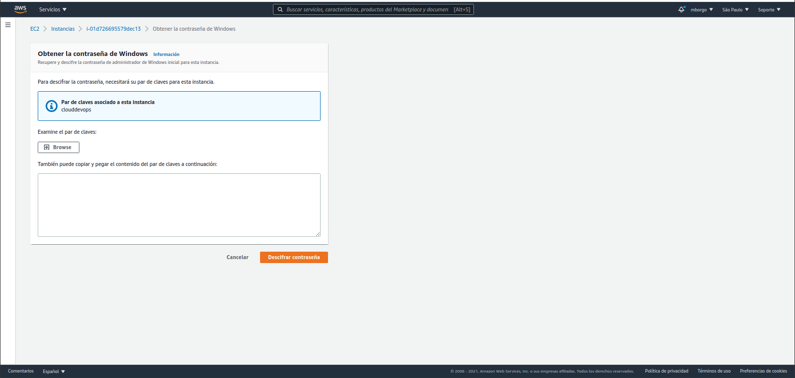

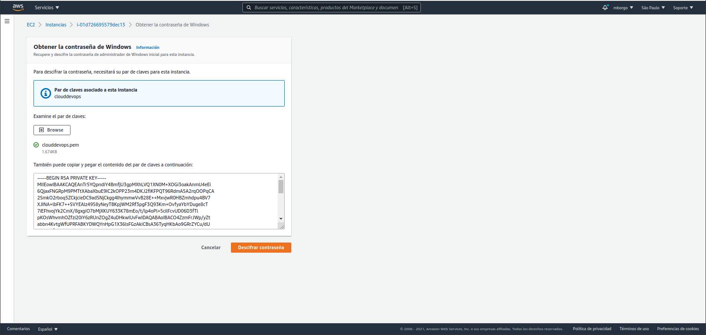

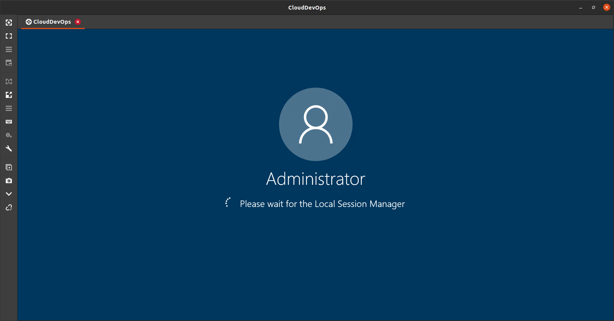

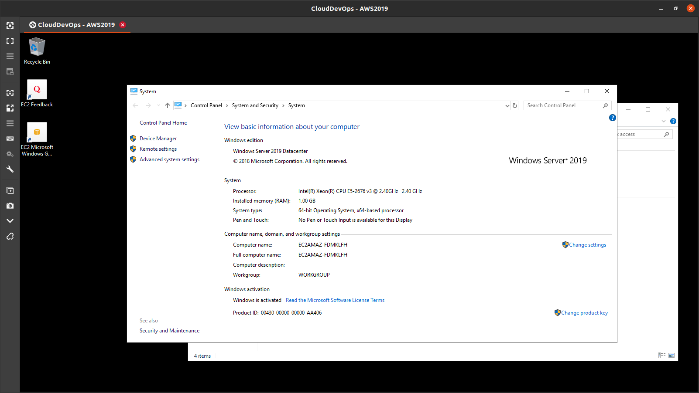

## Instancia de Windows Server 2012

- [x]  Detalle de la instancia

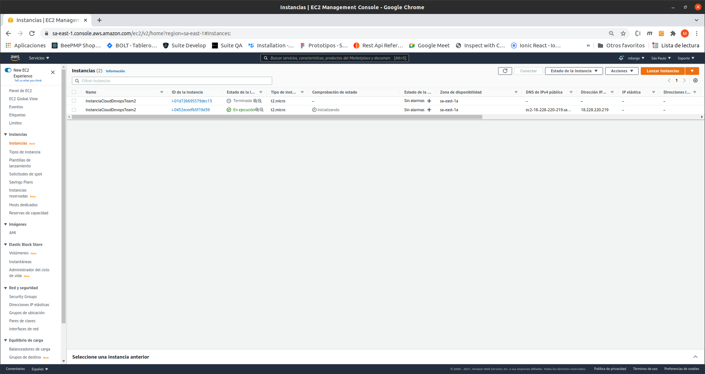

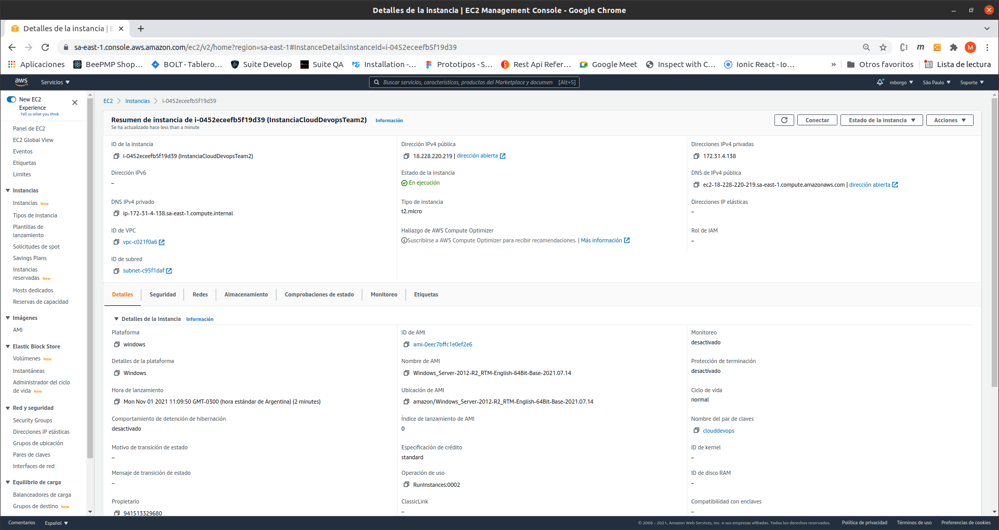

- [x]  Grupo de seguridad con zona de disponiblidad B de Sudamerica 

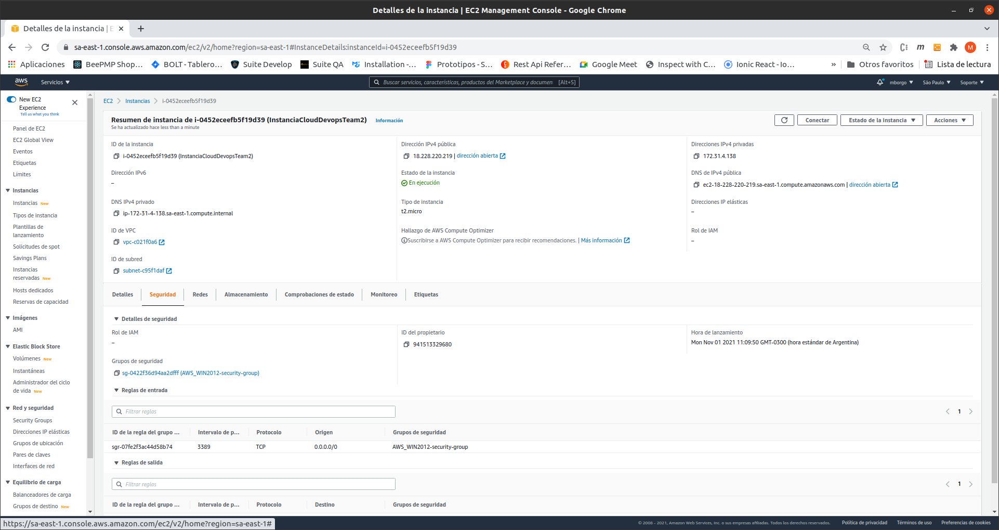

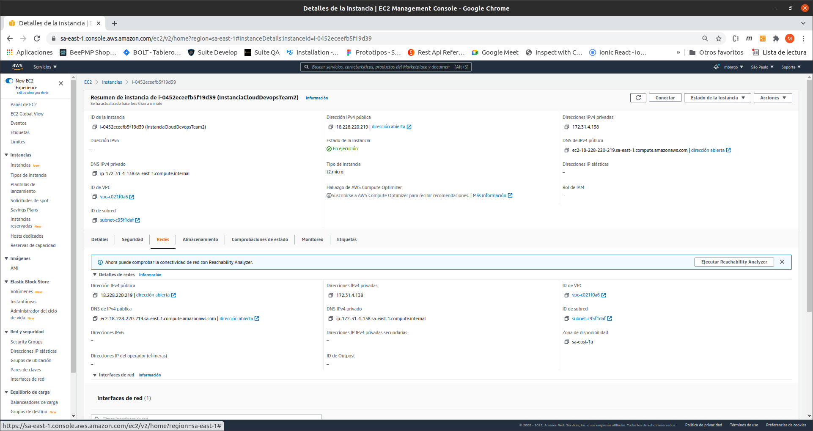

- [x]  Tags: Año. S.O., Equipo, Carrero, Institucion, Proyecto y Entorno

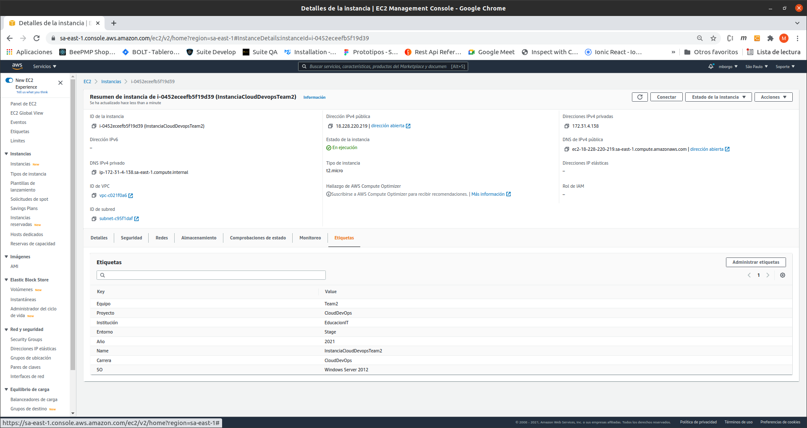

- [x]  Disco Rigido EBS de 30GB ABS

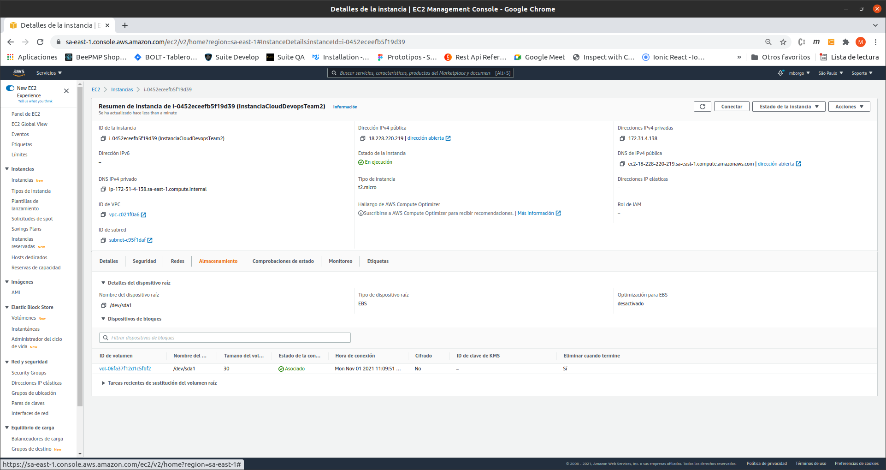

- [x]  Acceso por RDP a la instancia

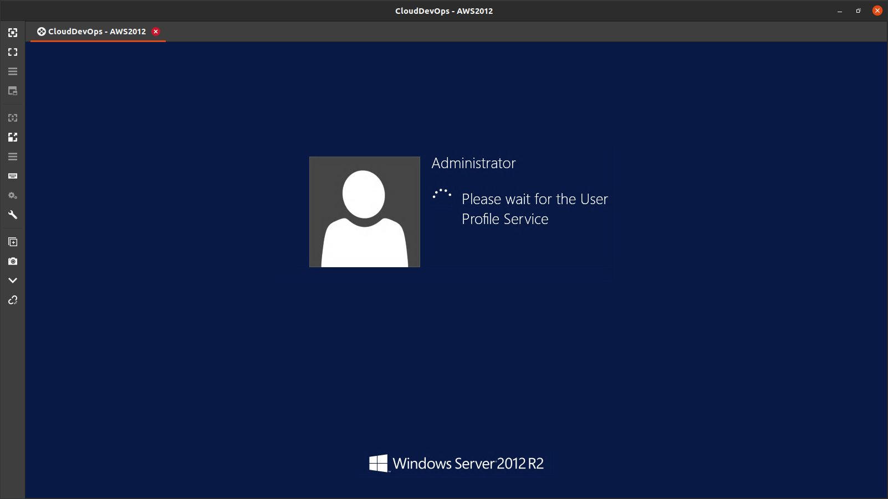

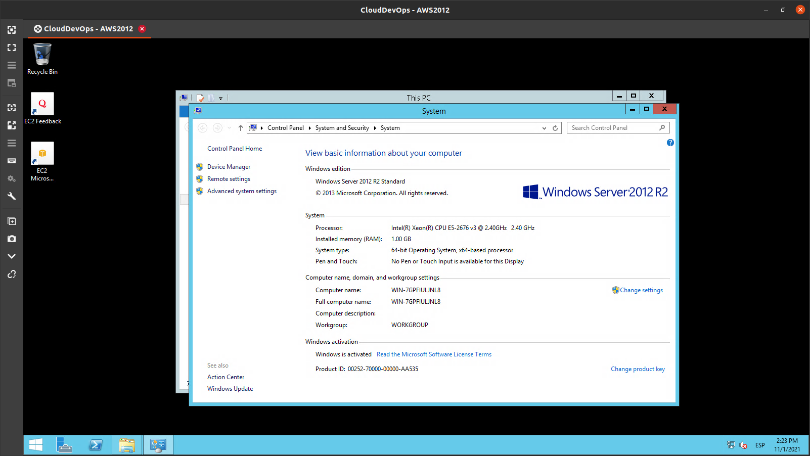

## Instancia de Windows Server 2016

- [x]  Detalle de la instancia

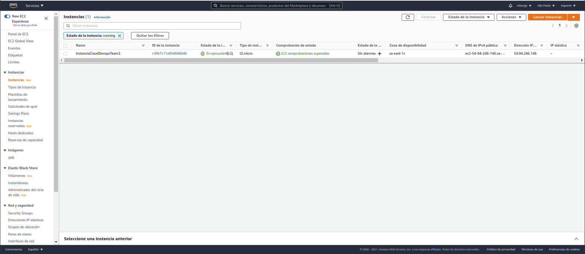

- [x]  Grupo de seguridad con zona de disponiblidad C de Sudamerica 

- [x]  Tags: Año. S.O., Equipo, Carrero, Institucion, Proyecto y Entorno

- [x]  Disco Rigido EBS de 30GB ABS

- [x]  Acceso por RDP a la instancia

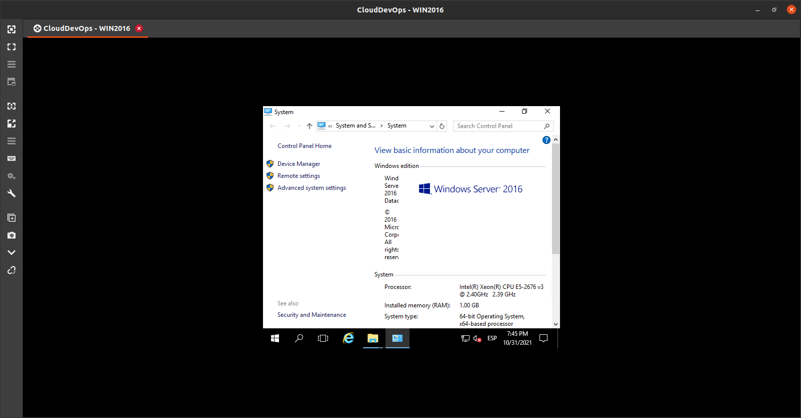
