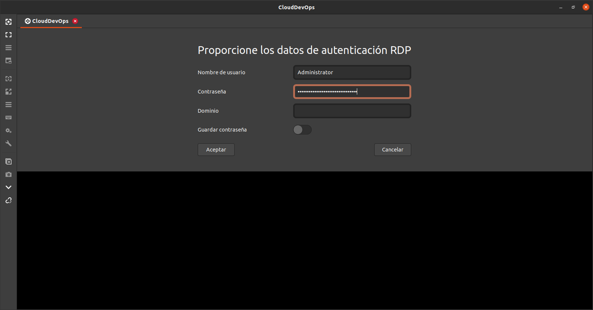
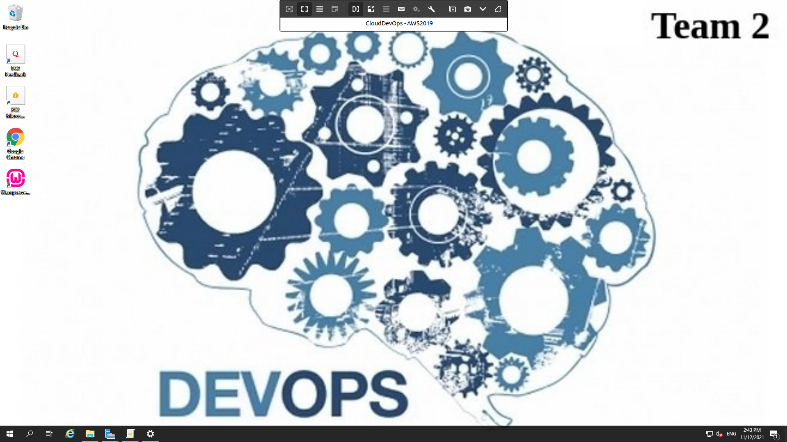

# Tarea 3. AWS

## Instancia de Windows Server 2019

- [x]  Detalle de la instancia

- [x]  Grupo de seguridad con zona de disponiblidad A de Sudamerica 

- [x]  Tags: Año. S.O., Equipo, Carrero, Institucion, Proyecto y Entorno

- [x]  Disco Rigido EBS de 30GB ABS

- [x]  Acceso por RDP a la instancia

- [x] Instalacion de Docker, WAMP, Kubernetes, Visual Code, Terraform, Jenkins y GIT

- [x] Fondo de pantalla

