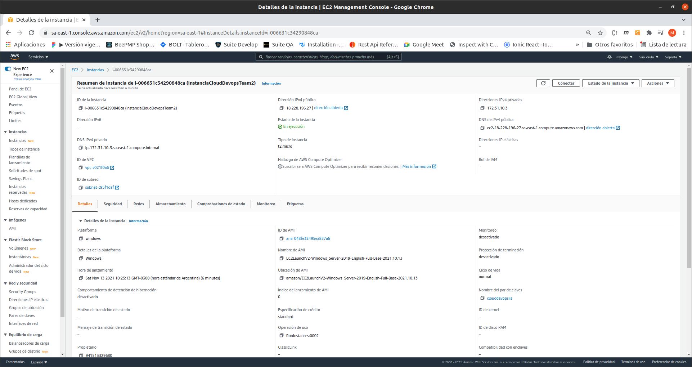
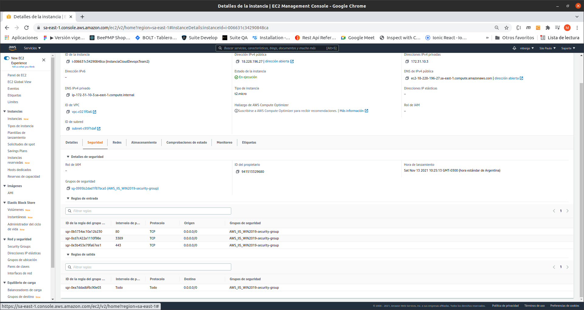
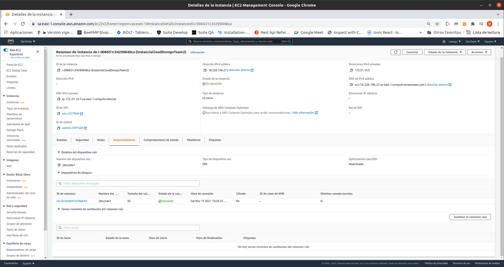
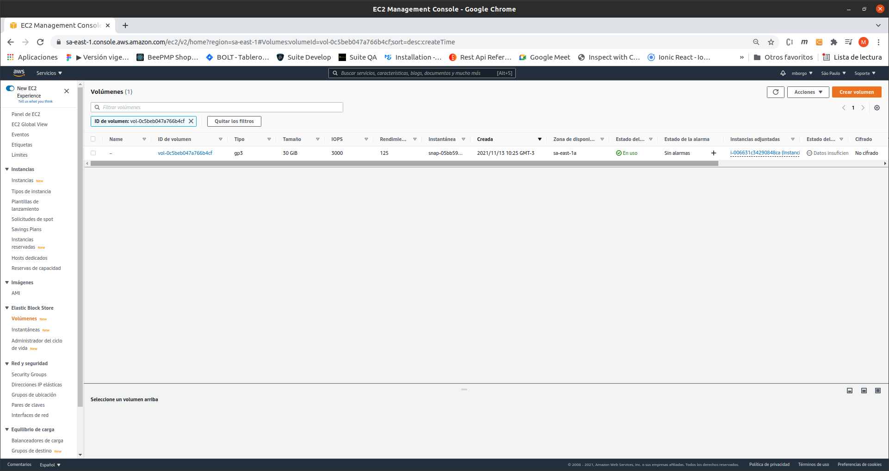
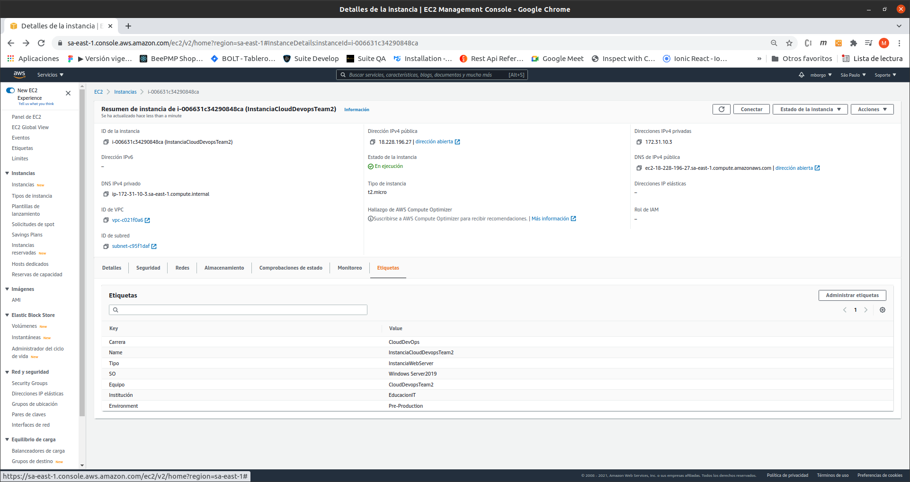
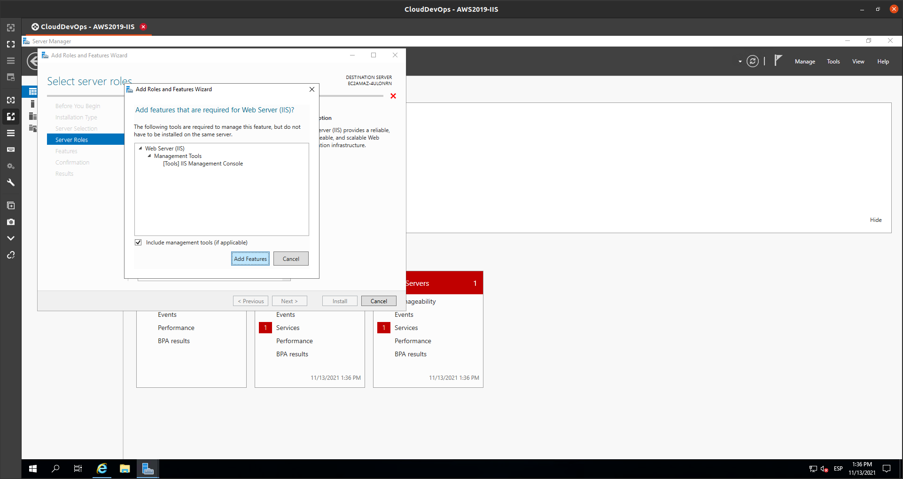
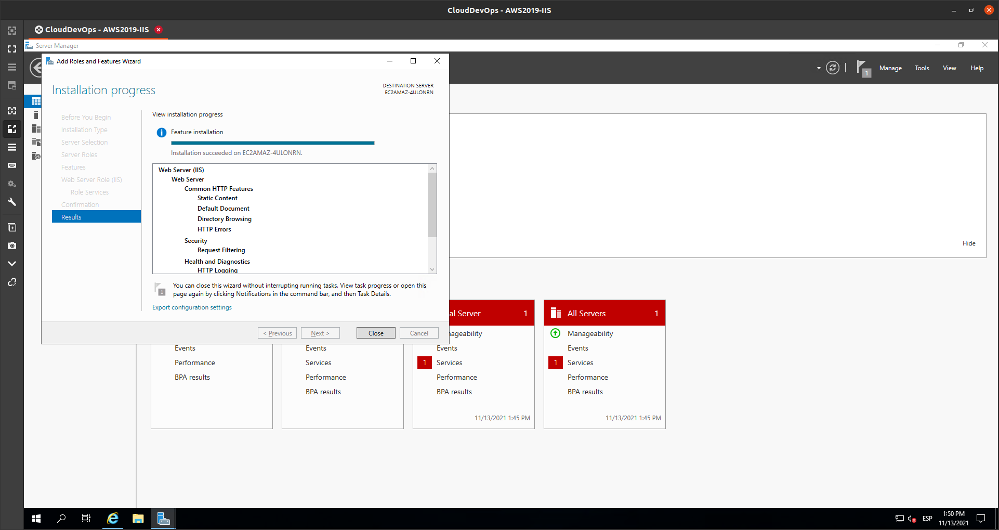
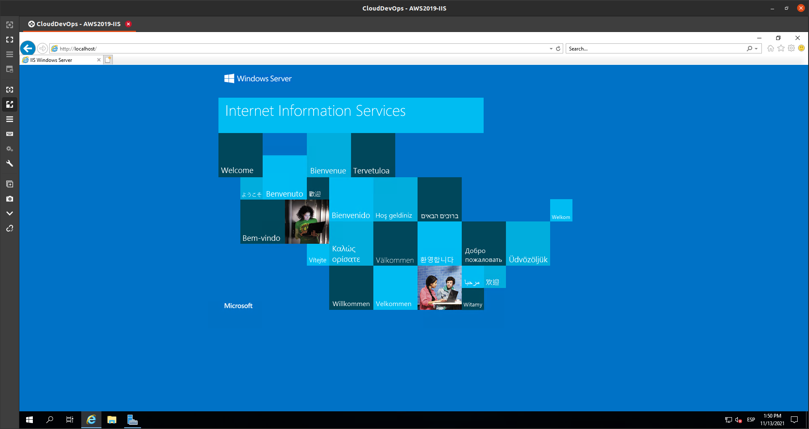
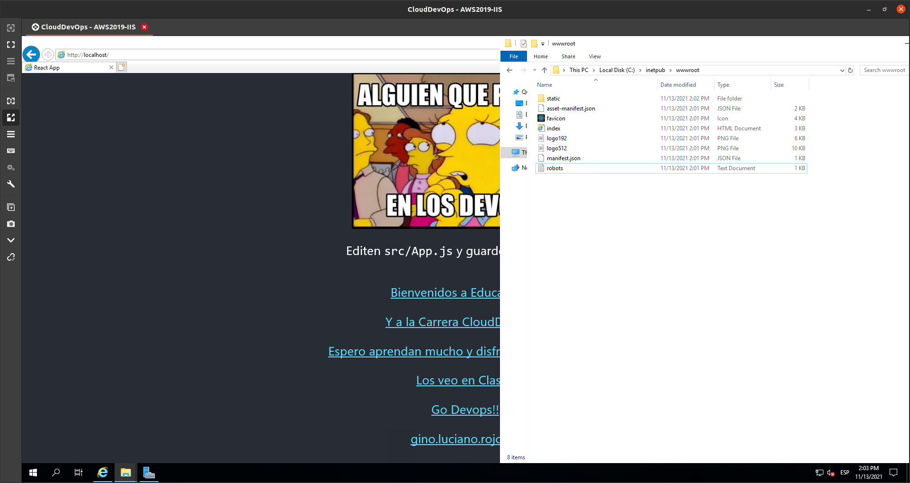
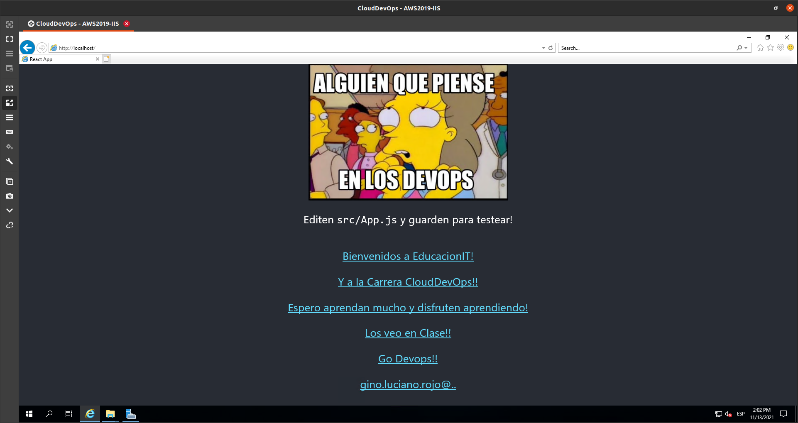

# Tarea 6. AWS - Despligue de aplicación en IIS

## Instancia de Windows Server 2019

- [x]  Detalle de la instancia

- [x]  Disco de 30GB SSD de 3era Generación

- [x]  Tags: Tipo. S.O., Equipo, Carrera, Institucion y Environment

- [x] Habilitacion de IIS

- [x] Despliegue de Aplicacion

