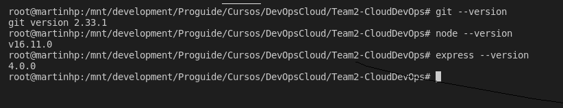
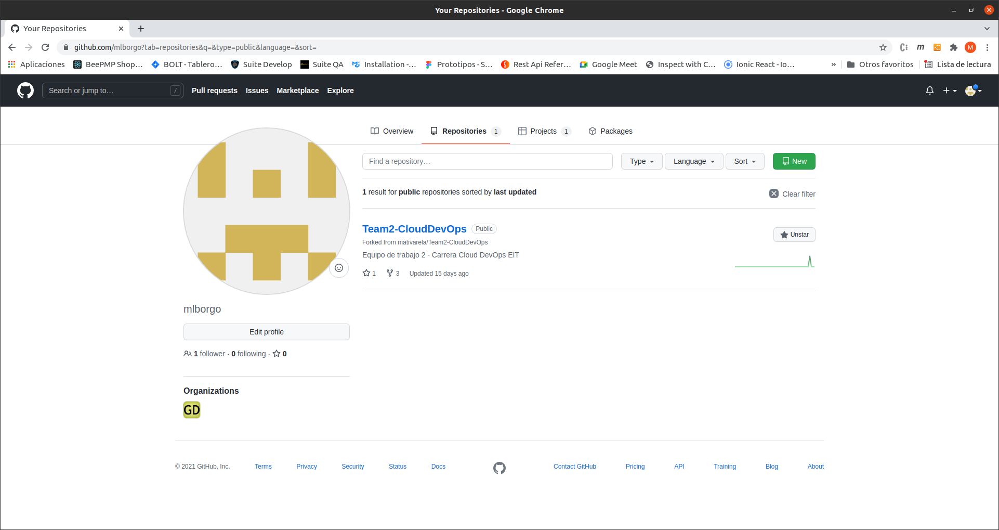
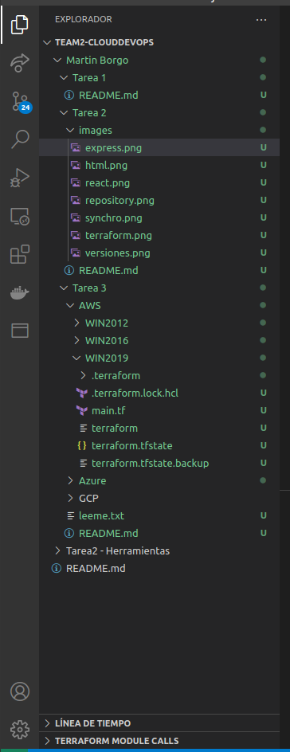
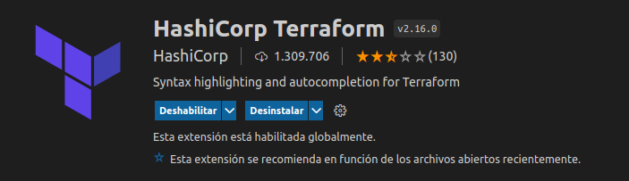
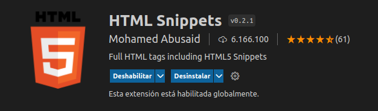
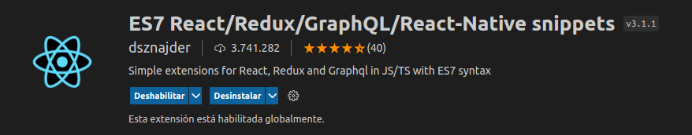
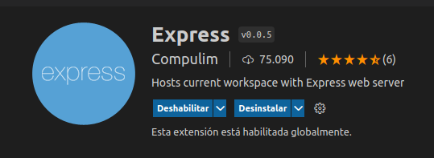

# Tarea 2

- [x]  Instalacion de GIT, NodeJS y Express en su última versión.

- [x]  Creación de un directorio sincronizado con el repositorio.

- [x]  Sincronizar Visual Studio Code con el repositorio.

- [x]  Instalacion de Plugins Terraform, HTML Marks, React y Express.

